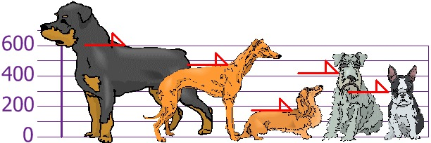
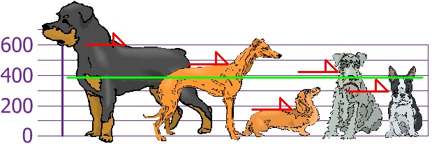
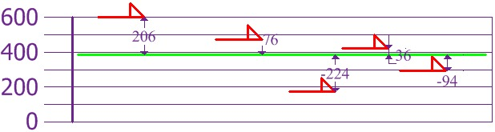
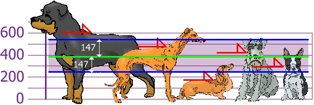
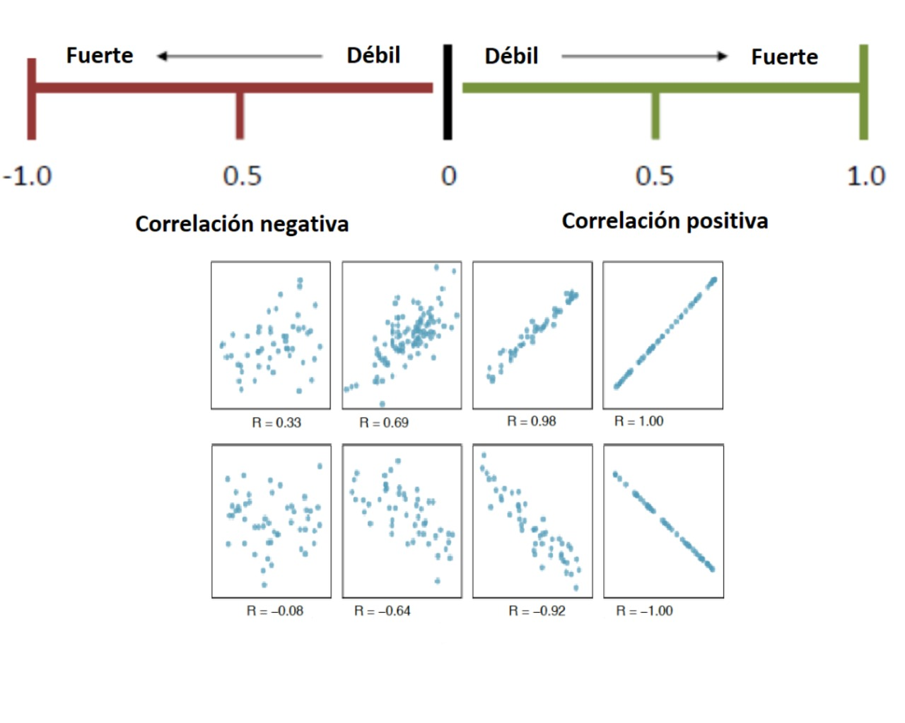

<div class="watermark"></div>

# Análisis de Componentes Principales

El análisis PCA (por sus siglas en inglés) es una **técnica de reducción de dimensión** útil tanto para el proceso de análisis exploratorio, el inferencial y predictivo. Es una técnica ampliamente usada en muchos estudios, pues permite sintetizar la información relevante y desechar aquello que no aporta tanto. Es particularmente útil en el caso de conjuntos de datos "amplios" en donde las **variables están correlacionadas entre sí** y donde se tienen muchas variables para cada observación. 

```{r, fig.align='center', out.height='400pt', out.width='600pt',echo=F}
knitr::include_graphics("img/02-pca/dimension_reduction.jpeg")
```


En los conjuntos de datos donde hay muchas variables presentes, no es fácil trazar los datos en su formato original, lo que dificulta tener una idea de las tendencias presentes en ellos. PCA permite ver la estructura general de los datos, identificando qué observaciones son similares entre sí y cuáles son diferentes. Esto puede permitirnos identificar grupos de muestras que son similares y determinar qué variables hacen a un grupo diferente de otro.

## Medidas de dispersión

Las medidas de dispersión tratan, a través del cálculo de diferentes fórmulas, de arrojar un valor numérico que ofrezca información sobre el grado de variabilidad de una característica

En otras palabras, las medidas de dispersión son números que indican si una variable se mueve mucho, poco, más o menos que otra. La razón de ser de este tipo de medidas es conocer de manera resumida una característica de la variable estudiada. En este sentido, deben acompañar a las medidas de tendencia central. Juntas, ofrecen información de un sólo vistazo que luego podremos utilizar para comparar y, si fuera preciso, tomar decisiones.

Dos de las medidas principales son la **varianza** también denotada como $\sigma^2$ y la **desviación estándar** $\sigma$.

La *varianza* es una medida de dispersión que representa la variabilidad de una serie de datos respecto a su media y la **desviación estándar**  es la separación que existe entre un valor cualquiera de la serie y la media.

#### Ejemplo: {-}

Tú y tus amigos han medido las alturas de sus perros (en milímetros):

```{r, echo=FALSE,fig.align='center', out.width='500pt'}

```


Las alturas (hasta el lomo de cada perro) son: 600mm, 470mm, 170mm, 430mm y 300mm.
Si calculamos la media, sería: 

$$ Media = \frac{1}{n}\sum_{i=1}^{n}{x_i} = \frac{600 + 470 + 170 + 430 + 300}{5} = 394 $$

así que la altura media es 394 mm. Si se dibuja esto en el gráfico:


```{r, , echo=FALSE,fig.align='center', out.width='500pt'}

```


Si ahora se calcula la diferencia de cada altura con la media:

```{r, echo=FALSE,fig.align='center', out.width='500pt'}


```

Para calcular la **Varianza**,  se toma cada diferencia, se eleva al cuadrado y se calcula la media:
 
$$ Varianza = \frac{1}{n}\sum_{i=1}^{n}(x_i-\bar{x})^2 = \frac{206^2 + 76^2 + (−224)^2 + 36^2 + (−94)^2}{5} = 21,704$$

Por otro lado, la **desviación estándar** se calcula como la raíz cuadrada de la varianza, entonces: 

$$\sigma = \sqrt{\sigma^2}	=	\sqrt{21704} = \pm 147 $$

Si se dibuja esta distancia, ahora se pueden  ver qué alturas están dentro de una desviación estándar (147mm) de la media:


```{r, echo=FALSE,fig.align='center', out.width='500pt'}

```

Por lo tanto, usando la desviación estándar tenemos una manera "estándar" de saber qué es normal, o extra grande o extra pequeño.

Los Rottweilers son perros grandes. Y los Dachsunds (perro salchicha) son un poco pequeños, ¿cierto?


La tercera medida que se revisará es el **coeficiente de correlación lineal** ($\rho$) que es también solo llamada **"correlación"** es una medida de regresión que pretende cuantificar el grado de variación conjunta entre dos variables. 

Dicha medida puede encontrarse entre -1 y 1, donde se pueden tener las siguientes interpretaciones dependiendo de su valor: 

```{r, echo=FALSE,fig.align='center', out.width='500pt'}

```

En pocas palabras, mide qué tanto varía una característica en la medida en que varía otra. La fórmula para calcular el grado de correlación es:

$$Cor(x, y) = \frac{\sum_{i=1}^n{(x_i-\bar{x})(y_i-\bar{y})}}{\sqrt{\sum(x_i-\bar{x})^2}\sqrt{\sum(y_i-\bar{y})^2}}$$

## Construcción matemática

Sea $X$ una matriz de $n$ renglones y $p$ columnas, se denota por $X_i$ a la *i-ésima* columna que representa una característica del conjunto en su totalidad...

* Se desean crear nuevas variables llamadas **Componentes Principales**, las cuales son creadas como combinación lineal (suma ponderada) de las variables originales, por lo que cada una de las variables nuevas contiene parcialmente información de todas las variables originales.

$$Z_1 = a_{11}X_1 +a_{12}X_2 + ... + a_{1p}X_p$$
$$Z_2 = a_{21}X_1 +a_{22}X_2 + ... + a_{2p}X_p$$
$$...$$
$$Z_p = a_{p1}X_1 +a_{p2}X_2 + ... + a_{pp}X_p$$

Donde: 

> $Z_i$ es la iésima componente nueva creada como combinación de las características originales
>
> $X_1, X_2, ... X_p$ son las columnas (variables originales)
>
> $a_{ij}$ es el peso o aportación de cada columna *j* a la nueva componente *i*.


* Se desea que la primer componente principal capture la mayor varianza posible de todo el conjunto de datos.

$$\forall i \in 2,...,p \quad Var(Z_1)>Var(Z_i)$$

* La segunda componente principal deberá **SER INDEPENDIENTE** de la primera y deberá abarcar la mayor varianza posible del restante. Esta condición se debe cumplir para toda componente *i*, de tal forma que las nuevas componentes creadas son independientes entre sí y acumulan la mayor proporción de varianza en las primeras de ellas, dejando la mínima proporción de varianza a las últimas componentes.

$$Z_1 \perp\!\!\!\perp Z_2 \quad \& \quad Var(Z_1)>Var(Z_2)>Var(Z_i)$$

* El punto anterior permite desechar unas cuantas componentes (las últimas) sin perder mucha varianza. 

::: {.infobox .note data-latex="{note}"}
**¡¡ RECORDAR !!**

* **A través de CPA se logra retener la mayor cantidad de varianza útil pero usando menos componentes que el número de variables originales.**

* **Para que este proceso sea efectivo, debe existir ALTA correlación entre las variables originales.**
:::


Cuando muchas variables se correlacionan entre sí, todas contribuirán fuertemente al mismo componente principal. Cada componente principal suma un cierto porcentaje de la variación total en el conjunto de datos. Cuando sus variables iniciales estén fuertemente correlacionadas entre sí y podrá aproximar la mayor parte de la complejidad de su conjunto de datos con solo unos pocos componentes principales. 

Agregar componentes adicionales hace que la estimación del conjunto de datos total sea más precisa, pero también más difícil de manejar.


### Eigenvalores y eigenvectores

Estimar la ponderación adecuada que debe tener cada una de características para crear las nuevas componentes es un paso crucial en este análisis. Se puede demostrar bajo una rigurosa metodología matemática que la solución que permite obtener resultados óptimos se logra cuando:

$$Xv=\lambda v$$
Donde:

> $X$ es la matriz de correlación calculada a partir de los datos originales
>
> $v$ es el vector con los pesos de cada columna (eigenvector).
>
> $\lambda$ corresponde a la varianza de cada nueva componente (eigenvalor).

Este resultado corresponde al cálculo de los *eigenvectores* $v$ (vectores propios) y eigenvalores $\lambda$ (valores propios) de una matriz de datos.

Los vectores propios y los valores propios vienen en pares: **cada vector propio tiene un valor propio correspondiente**. Los vectores propios son la ponderación que permite crear la combinación lineal de las variables para conformar cada componente principal, mientras que el valor propio es la varianza asociada a cada componente principal. 

::: {.infobox .pin data-latex="{pin}"}

* El valor propio de una componente es la varianza de este.

* La suma acumulada de los primeros $j$ eigenvalores representa la varianza acumulada de las primeras $j$ componentes principales
:::

El número de valores propios y vectores propios que existe es igual al número de dimensiones que tiene el conjunto de datos.

Para una mayor explicación matemática, este [libro](https://www.amazon.com/Methods-Multivariate-Analysis-Alvin-Rencher/dp/0470178965) ofrece un amplio capítulo dedicado exclusivamente al análisis de componentes principales


## Implementación en R

Para ejemplificar el uso de CPA, usaremos los [datos](https://drive.google.com/file/d/1eMBDMxtbRel4BQ0RqMnuwGr-nGNzshgc/view?usp=sharing) de CONAPO para replicar el índice de marginación social, el cual pretende dar una medida de pobreza por regiones, las cuales pueden ser entidades, municipios, localidades, agebs o incluso manzanas\*.

Existen MUUUCHAS librerías que facilitan el análisis de componentes principales. En este [blog](https://aedin.github.io/PCAworkshop/articles/b_PCA.html) se puede encontrar la diferencia en su implementación. Todas ofrecen resultados útiles y confiables.

```{r, warning=FALSE, message=FALSE}
library(sf)
library(magrittr)
library(tidymodels)

indice_marg <- st_read('data/IMEF_2010.dbf', quiet = TRUE)
glimpse(indice_marg)

indice_marg %>% dplyr::count(GM, sort = TRUE)
```

```{r}
pca_recipe <- recipe(IM ~ ., data = indice_marg) %>%
  update_role(NOM_ENT, GM, new_role = "id") %>%
  step_normalize(ANALF, SPRIM, OVSDE, OVSEE, OVSAE, VHAC, OVPT, PL_5000, PO2SM) %>%
  step_pca(ANALF, SPRIM, OVSDE, OVSEE, OVSAE, VHAC, OVPT, PL_5000, PO2SM, num_comp=9, res="res") %>% 
  step_rm(LUGAR, AÑO, POB_TOT) %>% 
  prep()

juice(pca_recipe)
```

Veamos los pasos de esta receta:

* Primero, debemos decirle a la receta qué datos se usan para predecir la variable de respuesta.

* Se actualiza el rol de las variables *nombre de entidad*  y *grado de marginación* con la función `NOM_ENT`, ya que es una variable que queremos mantener por conveniencia como identificador de filas, pero no son un predictor ni variable de respuesta.

* Necesitamos centrar y escalar los predictores numéricos, porque estamos a punto de implementar **PCA**.

* Finalmente, usamos `step_pca()` para realizar el análisis de componentes principales.

* La función `prep()` es la que realiza toda la preparación de la receta.

Una vez que hayamos hecho eso, podremos explorar los resultados del **PCA**. Comencemos por ver cómo resultó el **PCA**. Podemos ordenar los resultados mediante la función `tidy()`, incluido el paso de **PCA**, que es el segundo paso. Luego hagamos una visualización para ver cómo se ven los componentes.

A continuación se muestran la desviación estándar, porcentaje de varianza y porcentaje de varianza acumulada que aporta cada componente principal.

```{r}
summary(pca_recipe$steps[[2]]$res)
```

```{r, echo=FALSE, eval=FALSE}
library(forcats)

tidied_pca <- tidy(pca_recipe, 2)

tidied_pca %>%
  filter(component %in% paste0("PC", 1:5)) %>%
  mutate(component = fct_inorder(component)) %>%
  ggplot(aes(value, terms, fill = terms)) +
  geom_col(show.legend = FALSE) +
  facet_wrap(~component, nrow = 1) +
  labs(y = NULL)+
  theme_minimal() +
  ggtitle("Aportación de variables a cada componente principal")
```

Podemos observar que en la primera componente principal, las $9$ variables que utilizó el Consejo Nacional de Población para obtener el [Índice de Marginación 2010](http://www.conapo.gob.mx/work/models/CONAPO/Resource/862/4/images/06_C_AGEB.pdf) aportan de manera positiva en el primer componente principal.


```{r}
library(tidytext)

tidied_pca <- tidy(pca_recipe, 2)

tidied_pca %>%
  filter(component %in% paste0("PC", 1:4)) %>%
  group_by(component) %>%
  top_n(9, abs(value)) %>%
  ungroup() %>%
  mutate(terms = reorder_within(terms, abs(value), component)) %>%
  ggplot(aes(abs(value), terms, fill = value > 0)) +
  geom_col() +
  facet_wrap(~component, scales = "free_y") +
  scale_y_reordered() +
  labs(
    x = "Absolute value of contribution",
    y = NULL, fill = "Positive?"
  )+
  theme_minimal()
```

Notamos que las $9$ variables aportan entre el $25\%$ y el $35\%$ a la
primera componente principal.


## Reducción de dimensión

Existe en la literatura basta información sobre el número de componentes a retener en un análisis de PCA. El siguiente gráfico lleva por nombre **gráfico de codo** y muestra el porcentaje de varianza explicado por cada componente principal.

```{r, message=FALSE, warning=FALSE}
library(factoextra)
library(FactoMineR)

res.pca <- indice_marg %>%
  select(ANALF, SPRIM, OVSDE, OVSEE, OVSAE, VHAC, OVPT, PL_5000, PO2SM) %>% 
  as.data.frame() %>% 
  set_rownames(indice_marg$NOM_ENT) %>% 
  FactoMineR::PCA(graph=FALSE)

fviz_eig(res.pca, addlabels=TRUE, ylim=c(0, 100))
```

```{r, message=FALSE, warning=FALSE, eval=FALSE, echo=FALSE}
fviz_pca_biplot(
  X = res.pca, repel = T, addEllipses=F, geom = c("point", "text"),
  habillage=as.factor(indice_marg$GM)
  )
```

El gráfico anterior muestra que hay una diferencia muy grande entre la varianza retenida por la 1er componente principal y el resto de las variables. Dependiendo del objetivo del análisis, podrá elegirse el numero adecuado de componentes a retener, no obstante, la literatura sugiere retener 1 o 2 componentes principales.

Es posible realizar el proceso de componentes principales y elegir una de las dos opciones siguientes:

1. Especificar el número de componentes a retener

2. Indicar el porcentaje de varianza a alcanzar

La segunda opción elegirá tantas componentes como sean necesarias hasta alcanzar el hiperparámetro mínimo indicado. A continuación se ejemplifica:

**Caso 1:**

```{r}
pca_recipe <- recipe(IM ~ ., data = indice_marg) %>%
  update_role(NOM_ENT, GM, new_role = "id") %>%
  step_normalize(ANALF, SPRIM, OVSDE, OVSEE, OVSAE, VHAC, OVPT, PL_5000, PO2SM) %>%
  step_pca(ANALF, SPRIM, OVSDE, OVSEE, OVSAE, VHAC, OVPT, PL_5000, PO2SM,num_comp=2) %>% 
  step_rm(LUGAR, AÑO, POB_TOT) %>% 
  prep()

juice(pca_recipe)
```

**Caso 2:**

```{r}
pca_recipe <- recipe(IM ~ ., data = indice_marg) %>%
  update_role(NOM_ENT, GM, new_role = "id") %>%
  step_normalize(ANALF, SPRIM, OVSDE, OVSEE, OVSAE, VHAC, OVPT, PL_5000, PO2SM) %>%
  step_pca(ANALF, SPRIM, OVSDE, OVSEE, OVSAE, VHAC, OVPT, PL_5000, PO2SM,threshold=0.90) %>% 
  step_rm(LUGAR, AÑO, POB_TOT) %>% 
  prep()

juice(pca_recipe)
```

Así es como usaremos el análisis de componentes principales para mejorar la estructura de variables que sirven de input para cualquiera de los modelos posteriores. Continuaremos con un paso más de pre-procesamiento antes de comenzar a aprender nuevos modelos.


## Representación gráfica

Uno de los gráficos más famosos al usar CPA es el Biplot, el cual busca representar en dos dimensiones el comportamiento y grado de asociación tanto entre las variables como las observaciones

El siguiente biplot permite analizar en dos dimensiones la relación entre variables

```{r}

fviz_pca_var(
  res.pca,
  col.var = "contrib", # Color by contributions to the PC
  gradient.cols = c("#00AFBB", "#E7B800", "#FC4E07"),
  repel = TRUE     # Avoid text overlapping
)
```

En este gráfico se logra apreciar que todas las características están asociadas a la misma dirección en relación con la primer componente principal, mientras que en la segunda componente existe un poco de diferencia.

Entre más pequeño sea el ángulo que separa a dos vectores, mayor correlación existe entre las características. Adicionalmente, si el grado es cercano a los 180°, esto representa una perfecta correlación negativa. Por último, grados cercanos a los 90° ocurren cuando las variables son independientes.

Entre más larga es la longitud de cada vector, esto representa mayor varianza en la característica que se está observando.

A continuación, se muestra otra versión del biplot en donde se analizan tanto las variables como las observaciones

```{r}
fviz_pca_biplot(
  res.pca, repel = TRUE,
  col.var = "#2E9FDF", # Variables color
  col.ind = "#696969"  # Individuals color
)
```


La proyección ortogonal de cada punto en un vector permite conocer el grado positivo o negativo de una observación en relación con cada una de las variables. Por ejemplo...

1. La proyección del Distrito Federal con cada una de las variables se encuentra en la dirección negativa, lo que implica que la relación de esta entidad con las variables que miden pobreza es negativa.

2. En el caso de Oaxaca, la relación es positiva, lo que implica que Oaxaca tiene una marginación alta.

A partir de estas gráficas, se logran realizar simplificaciones o variaciones de gráficas para estudiar posibles agrupaciones, como se muestra en el siguiente gráfico.

```{r}
library(ggrepel)

juice(pca_recipe) %>%
  mutate(GM = factor(GM, levels = c("Muy alto", "Alto", "Medio", "Bajo", "Muy bajo")), 
         ordered = T) %>% 
  ggplot(aes(PC1, PC2, label = NOM_ENT)) +
  geom_point(aes(color = GM), alpha = 0.7, size = 2) +
  geom_text_repel() +
  ggtitle("Grado de marginación de entidades")

```

Finalmente, podemos observar como (de izquierda a derecha) los estados con grado de marginación Muy bajo, Bajo, Medio, Alto y Muy Alto respectivamente. 

```{r}
juice(pca_recipe) %>% 
  ggplot(aes(x = IM, y = PC1)) +
  geom_smooth(method = "lm") +
  geom_point(size = 2) +
  ggtitle("Comparación: Índice Marginación Vs PCA CP1")
```


## Predicciones

Es bastante común que sea necesario ajustar o crear un análisis de componentes con la información disponible hasta cierto momento y posteriormente, nuevas observaciones son incorporadas al estudio. Sería incorrecto volver a crear el análisis cada vez que una observación nueva llega.

Otro escenario de interés se da cuando se tiene muchísima información (millones de datos) y resulta costoso computacionalmente estar creando el modelo usando toda la información.

En ambos escenarios, la solución está en **realizar el análisis de componentes principales con una muestra de los datos y posteriormente realizar la predicción de nuevas observaciones ya teniendo creado el modelo**


El siguiente ejemplo contiene datos de atletas y su desempeño en competencias deportivas. 

```{r}
glimpse(decathlon2)

```

Se eliminarán las últimas 3 columnas para trabajar exclusivamente con las que hacer referencia al desempeño en cada una de las actividades deportivas. 

```{r}
decathlon2_train <- decathlon2[1:23, 1:10]
glimpse(decathlon2_train)
```

En este ejercicio se usará la librería *stats* y la función *prcomp* para llevar a cabo el análisis.

```{r}
res.pca <- stats::prcomp(decathlon2_train, scale = TRUE)
res.pca
```

Las 10 variables anteriores son las componentes principales creadas a partir de las variables originales. Se puede apreciar en la siguiente línea el impacto que tiene cada componente en términos de varianza.

```{r}
summary(res.pca)
```
```{r}
fviz_eig(res.pca, addlabels=TRUE, ylim=c(0, 100))
```

Ahora considérese nuevas observaciones que desean re calculadas usando el análisis de componentes principales. Es indispensable contar con la información de las 10 variables con las que se construyó el modelo.

```{r}
decathlon2_new <- decathlon2[24:27, 1:10]
decathlon2_new[, 1:6]
```

Finalmente, se hace uso de la función *predict* para calcular el valor de las componentes principales en cada uno de los nuevo individuos:


```{r}
decathlon2_new_coord <- predict(res.pca, newdata = decathlon2_new)
decathlon2_new_coord[, 1:4]
```
Estos resultados pueden integrarse a las gráficas realizadas para comparar su ubicación en relación con los datos originales usados cuando se creó el modelo.


```{r}
# Gráfico con observaciones originales en biplot
p <- fviz_pca_ind(res.pca, repel = TRUE)

# Se agregan nuevas observaciones
fviz_add(p, decathlon2_new_coord, color ="blue", repel = T)
```


