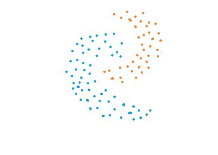
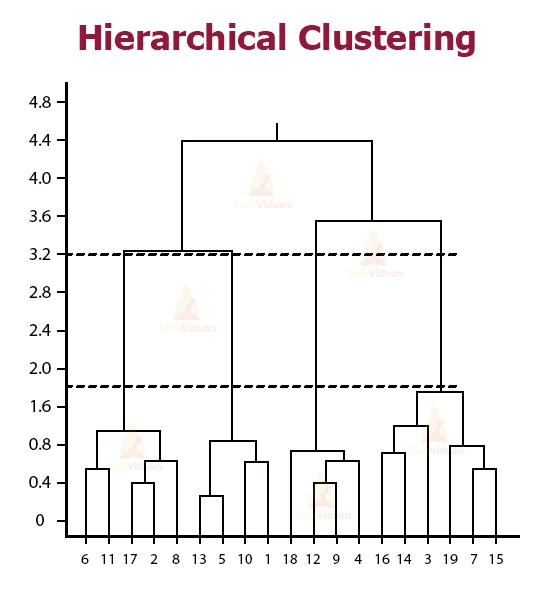

<div class="watermark"></div>

# Clustering Jerárquico

En esta sección se analizarán diferentes metodologías que tienen como propósito realizar segmentaciones de unidades de manera jerárquica, es decir, a partir de un único grupo se van agrupando o separando los individuos dependiendo de qué tan lejanos o cercanos se encuentran unos de otros. Las principales metodologías a revisar serán:

* Liga simple o vecino más cercano

* Liga compleja o vecino más lejano

* Liga promedio

* Liga centroide

* Varianza mínima de Ward

```{r, echo=FALSE, out.width='350pt'}
knitr::include_graphics("img/04-hclus/01-clusters.jpeg")
knitr::include_graphics("img/04-hclus/02-clusters.jpeg")
knitr::include_graphics("img/04-hclus/03-clusters.jpeg")


```


A partir del concepto de distancia entre puntos en un espacio de *N* dimensiones (variables), se realiza la agrupación de elementos para posteriormente calcular cuántos **grupos** es conveniente usar. Este proceso puede ser graficado de múltiples formas, sin embargo, la visualización más usada corresponde al **dendograma**, el cual es un gráfico como el presentado a continuación:

```{r, echo=FALSE, fig.align='center', out.width='400pt'}

knitr::include_graphics("img/04-hclus/06-Hierarchical-Clustering.webp")
```


* El eje horizontal representa los **puntos de datos**. 

* La altura a lo largo del eje vertical representa la **distancia entre los grupos**. 

* Las líneas verticales en el gráfico representan grupos. 

* La altura de estas líneas representa la distancia desde el grupo más cercano. 

Podemos encontrar el número de conglomerados que mejor representan los grupos en los datos usando el dendrograma. 

```{r, echo=FALSE, fig.align='center', out.width='400pt'}


```

Las líneas verticales con las mayores distancias entre ellas, es decir, la mayor altura en el mismo nivel, dan el número de grupos que mejor representan los datos. 


